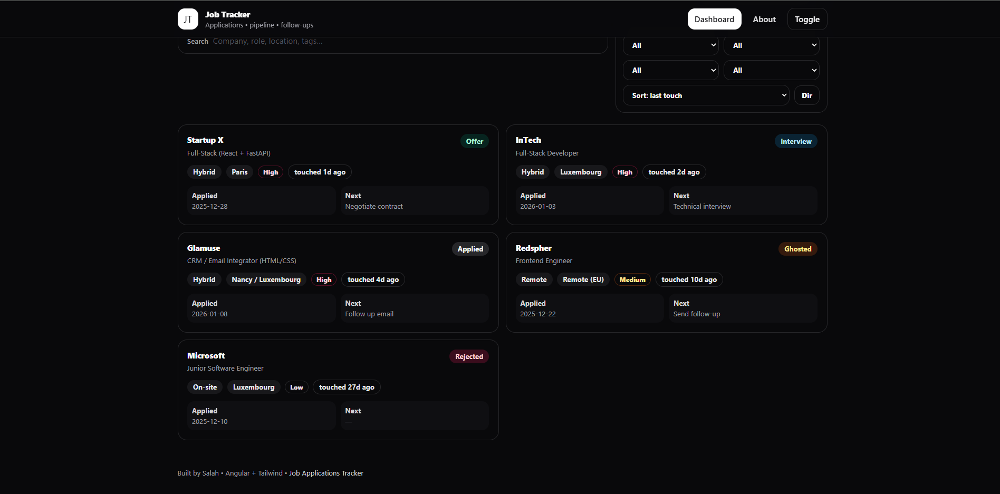

# Job Tracker (Angular)

A simple and clean job applications tracker built with Angular.  
Helps you keep track of your job pipeline, follow-ups, and application status without any backend.

## Preview

## Features
- Dashboard KPIs (total, active, interviews, offers, stale applications)
- Search and filtering
- Lightweight state management with RxJS
- Uses a local JSON dataset (no backend required)
- Clean, minimal UI focused on usability

## Tech Stack
- Angular (standalone components)
- RxJS
- TypeScript
- Tailwind CSS

## Getting Started

### Install dependencies
npm install

### Run the app
npm start

Then open your browser at:
http://localhost:4200

## Project Structure
- `src/app/features` – main application features
- `src/app/core` – models, services, and utilities
- `src/assets/data/applications.json` – sample dataset

## Data
All applications are loaded from a local JSON file:
src/assets/data/applications.json

This makes the project easy to run, test, and extend without setting up a backend.

## Possible Improvements
- Add / Edit application form
- CSV export
- Tag editor
- Animations and empty states
- Backend integration (API / database)

## Author
Built by Salah  
GitHub: https://github.com/boj1ck  
Portfolio: https://boj1ck.vercel.app/
